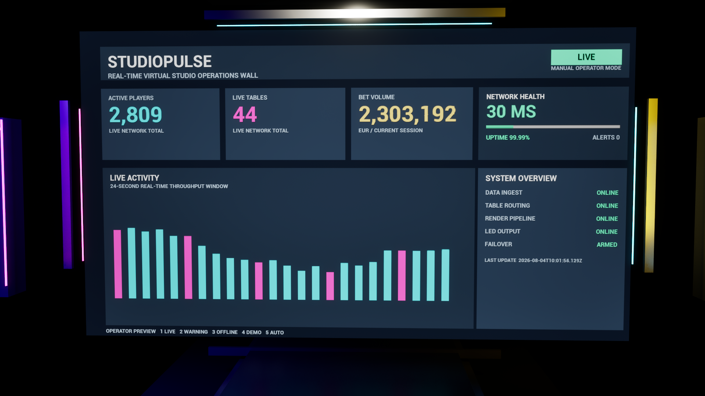
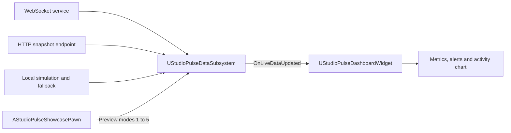
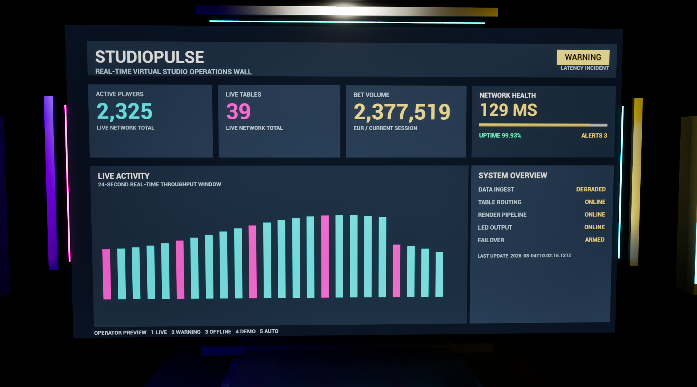
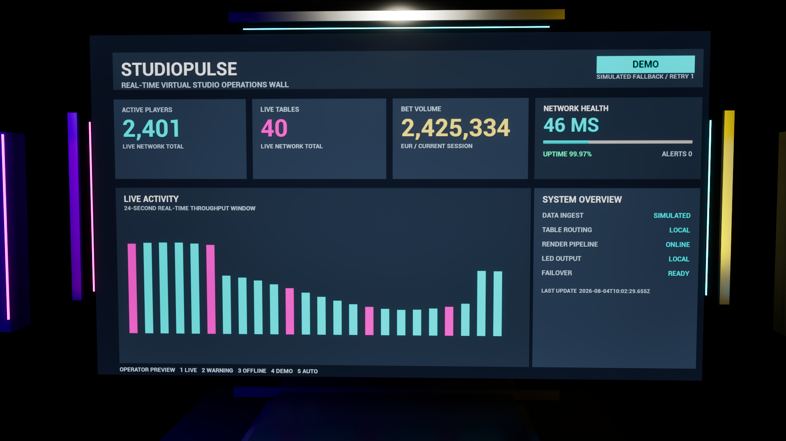

# StudioPulse

StudioPulse is a real-time virtual studio operations dashboard built in Unreal Engine 5.8 with a C++-first architecture.

It demonstrates live-data ingestion, fault-tolerant runtime behaviour, event-driven UI, programmatic UMG construction, automated verification, and standalone Windows delivery.



## Showcase

[Watch the 720p showcase video](media/studiopulse-showcase-720p.mp4)

The showcase covers:

- live operator preview;
- high-latency warning state;
- offline state;
- stable local demo mode;
- automatic mode with silent reconnect and simulated fallback.

## Technical Focus

- Unreal Engine C++ subsystem architecture
- WebSocket live-data communication
- HTTP JSON snapshot support
- reconnect scheduling and automatic fallback
- runtime JSON parsing and validation
- event-driven dashboard updates
- C++ WidgetTree construction
- automated tests
- packaged Windows Shipping build

## Runtime Architecture



### Main Classes

| Class | Responsibility |
|---|---|
| `UStudioPulseDataSubsystem` | Connection state, WebSocket callbacks, HTTP snapshots, JSON parsing, reconnect scheduling, preview modes and simulated fallback |
| `UStudioPulseDashboardWidget` | Programmatic C++ dashboard construction and event-driven presentation |
| `AStudioPulseShowcasePawn` | Presentation camera and keyboard mode switching |
| `AStudioPulseDisplayActor` | World-space display integration |

See [docs/ARCHITECTURE.md](docs/ARCHITECTURE.md) for the detailed design.

## Controls

| Key | Mode | Behaviour |
|---|---|---|
| `1` | Live | Manual live operator preview |
| `2` | Warning | Simulated high-latency incident |
| `3` | Offline | Simulated connection loss |
| `4` | Demo | Stable local simulated feed |
| `5` | Automatic | Uses live data when available and silently falls back while reconnecting |

## Automatic Fallback

```text
Live service available   -> LIVE
Live service unavailable -> DEMO fallback
Reconnect attempts       -> continue silently
Service restored         -> automatic return to LIVE
```

The external service is optional. Automatic mode remains visually stable instead of flashing a reconnect screen during repeated connection attempts.

## Default Local Endpoints

```text
HTTP snapshot: http://127.0.0.1:8090/snapshot
WebSocket:     ws://127.0.0.1:8091
```

## Automated Verification

StudioPulse contains Unreal Automation Framework tests under:

```text
Source/StudioPulse/Private/Tests/
```

The portfolio cleanup pass builds the Win64 Development Editor target and runs the complete `StudioPulse.*` automation suite before committing.

See:

- [Testing strategy and latest verified result](docs/TESTING.md)
- [Performance methodology](docs/PERFORMANCE.md)
- [Engineering roadmap](docs/ROADMAP.md)

Run the tests locally with:

```powershell
powershell -ExecutionPolicy Bypass -File ".\Tools\Run_StudioPulse_AutomationTests.ps1"
```

## Reusable Plugin Milestone

Standalone repository and packaged plugin: https://github.com/milenastrahova/VirtualStudioCore


StudioPulse now includes the source version of **Virtual Studio Core**, a reusable Unreal Engine plugin with separate Runtime and Editor modules.

It provides:

- reusable HTTP and WebSocket telemetry;
- reconnect and exponential backoff;
- simulated fallback;
- Blueprint API and delegates;
- Project Settings integration;
- editor configuration tooling;
- eight plugin-specific automation tests;
- a local Python mock backend.

See [docs/VIRTUAL_STUDIO_CORE_PLUGIN.md](docs/VIRTUAL_STUDIO_CORE_PLUGIN.md).

## Verified Host Integration

StudioPulse now consumes the standalone `VirtualStudioCore` plugin through a real C++ module dependency.

The host project includes:

- `AStudioPulsePluginBridgeActor`;
- host-facing Blueprint events;
- connection wrapper functions;
- direct access to plugin telemetry and connection state;
- three host integration tests;
- repeated verification of the complete plugin and StudioPulse test suites.

See [docs/PLUGIN_INTEGRATION.md](docs/PLUGIN_INTEGRATION.md).

## Repository Structure
```text
StudioPulse/
|-- Config/
|-- Content/
|   `-- StudioPulse/
|-- Source/
|   `-- StudioPulse/
|       |-- Private/
|       |   `-- Tests/
|       `-- Public/
|-- docs/
|-- media/
|-- Tools/
|-- StudioPulse.uproject
`-- README.md
```

Generated folders, packaged builds, Visual Studio solutions, and local backups are excluded from source control.

## Screenshots

### Live


### Warning



### Automatic simulated fallback



## Build Requirements

- Unreal Engine 5.8
- Windows 10 or Windows 11
- Visual Studio with C++ game-development tools
- Unreal Engine WebSockets module

## Reviewing the Project

1. Clone the repository.
2. Install Git LFS and run `git lfs pull`.
3. Open `StudioPulse.uproject`.
4. Build the C++ module when prompted.
5. Open the showcase map.
6. Use keys `1` to `5` to switch preview modes.

A ready-to-run Windows build is available under GitHub Releases.

## Portfolio Relevance

StudioPulse demonstrates Unreal Engine engineering beyond standard gameplay mechanics:

- backend-style communication;
- state-machine behaviour;
- reconnect and fallback handling;
- reusable subsystem architecture;
- automated verification;
- event-driven UI;
- programmatic UMG;
- packaging and standalone delivery.

## Author

**Milena Strahova**

- GitHub: https://github.com/milenastrahova
- ArtStation: https://www.artstation.com/milenastrahova