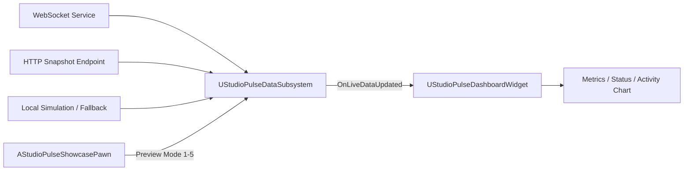

# StudioPulse

**StudioPulse** is a real-time virtual studio operations wall built in **Unreal Engine 5.8** with C++.

The project demonstrates a production-style monitoring dashboard with live WebSocket data, HTTP snapshots, automatic fallback simulation, reconnect handling, dynamic C++ UI construction, animated metrics, and a packaged Windows Shipping build.


## Showcase

[Watch the 720p showcase video](media/studiopulse-showcase-720p.mp4)

The showcase demonstrates:

- Live operator preview
- Warning / high-latency state
- Offline state
- Stable local demo mode
- Automatic mode with silent reconnect and simulated fallback

## Controls

| Key | Mode | Behaviour |
|---|---|---|
| `1` | Live | Manual live operator preview |
| `2` | Warning | Simulates a latency incident |
| `3` | Offline | Simulates a complete connection loss |
| `4` | Demo | Stable local simulated feed |
| `5` | Auto | Uses WebSocket/HTTP data when available and silently falls back to Demo while reconnecting |

## Key Features

- C++ `UGameInstanceSubsystem` for persistent data and connection management
- WebSocket live-data connection
- HTTP JSON snapshot support
- Automatic reconnect timer
- Silent simulated fallback when the live service is unavailable
- Manual preview modes for QA and presentation
- Runtime JSON parsing
- Event-driven dashboard updates through a multicast delegate
- Entire dashboard generated through C++ `WidgetTree`
- Animated 24-sample activity chart
- Dynamic latency, uptime, alert and system-state visualization
- C++ showcase pawn with camera movement and keyboard controls
- Standalone Windows Shipping build

## Architecture



The main runtime components are:

- `UStudioPulseDataSubsystem`  
  Owns connection state, WebSocket callbacks, HTTP snapshots, JSON parsing, reconnect scheduling, preview modes and simulated data.

- `UStudioPulseDashboardWidget`  
  Builds the complete operations dashboard in C++ and reacts to live data updates.

- `AStudioPulseShowcasePawn`  
  Provides the presentation camera and keyboard mode switching.

A more detailed breakdown is available in [docs/ARCHITECTURE.md](docs/ARCHITECTURE.md).

## Automatic Fallback Behaviour

In Auto mode:

```text
Live service available   -> LIVE
Live service unavailable -> DEMO fallback
Reconnect attempts       -> continue silently in the background
Service restored         -> automatic switch back to LIVE
```

The fallback remains visually stable instead of flashing a reconnect screen during repeated network attempts.

## Default Local Endpoints

```text
HTTP snapshot: http://127.0.0.1:8090/snapshot
WebSocket:     ws://127.0.0.1:8091
```

The external service is optional because Auto mode can continue using simulated fallback data.

## Build Requirements

- Unreal Engine 5.8
- Windows 10/11
- Visual Studio with C++ game-development tools
- Unreal Engine WebSockets module

## Running the Project

1. Open `StudioPulse.uproject`.
2. Build the C++ project when prompted.
3. Open the showcase map.
4. Press Play.
5. Use keys `1`–`5` to switch modes.

## Repository Structure

```text
StudioPulse/
├── Config/
├── Content/
├── Source/
│   └── StudioPulse/
│       ├── Private/
│       └── Public/
├── docs/
├── media/
├── StudioPulse.uproject
└── README.md
```

Generated folders such as `Binaries`, `Intermediate`, `Saved` and `DerivedDataCache` are intentionally excluded from source control.

## Screenshots

### Live


### Warning


### Automatic simulated fallback


## Portfolio Focus

This project was created to demonstrate practical Unreal Engine C++ skills beyond standard gameplay mechanics:

- real-time data integration;
- fault-tolerant runtime behaviour;
- subsystem architecture;
- event-driven UI updates;
- programmatic UMG construction;
- packaging and standalone delivery.

## Author

**Milena Strahova**

- ArtStation: https://www.artstation.com/milenastrahova
- GitHub: https://github.com/milenastrahova
