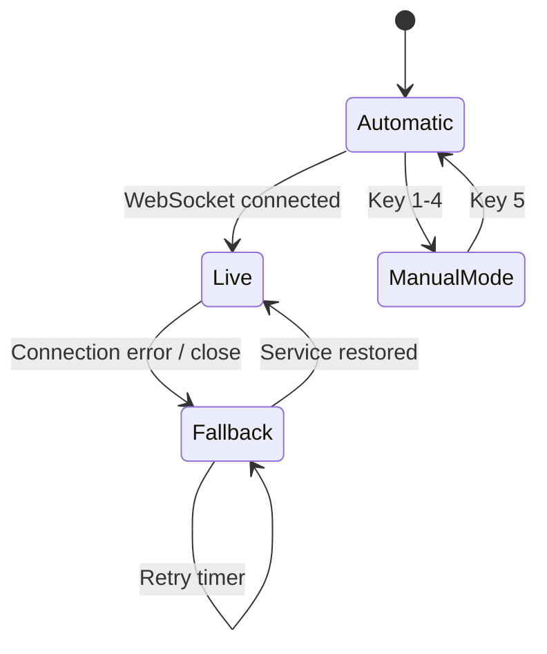
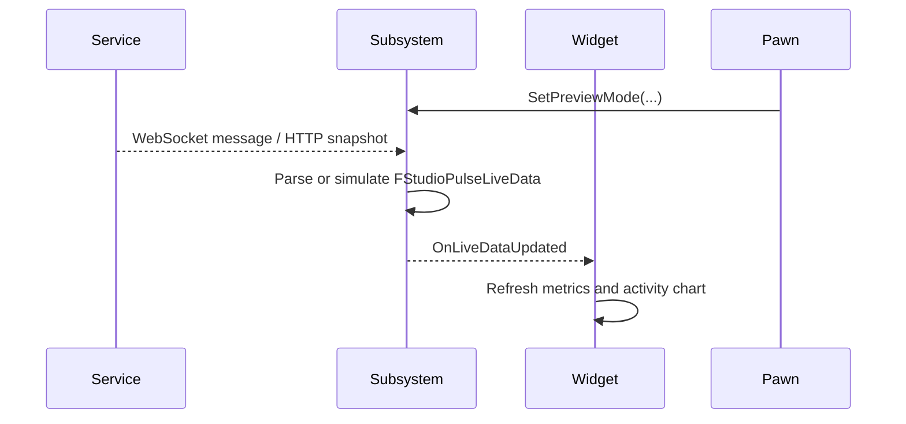

# StudioPulse Architecture

## Runtime Overview

StudioPulse separates data acquisition, presentation and user input into three main C++ classes.

## `UStudioPulseDataSubsystem`

Type: `UGameInstanceSubsystem`

Responsibilities:

- Own the current `FStudioPulseLiveData`
- Maintain the selected preview mode
- Open and close the WebSocket connection
- Request HTTP snapshots
- Parse JSON payloads
- Track connection status
- Schedule reconnect attempts
- Generate simulated fallback data
- Broadcast updates through `OnLiveDataUpdated`

Because the subsystem belongs to the game instance, its state persists independently of individual actors and widgets.

## Data Sources

### WebSocket

Default endpoint:

```text
ws://127.0.0.1:8091
```

WebSocket messages are parsed into `FStudioPulseLiveData`. Valid messages update the dashboard and set the visible state to `LIVE`.

### HTTP Snapshot

Default endpoint:

```text
http://127.0.0.1:8090/snapshot
```

The subsystem requests a JSON snapshot on a timer while running in Automatic mode.

### Local Simulation

Local data generation updates:

- active players;
- live tables;
- bet volume;
- latency;
- uptime;
- alerts;
- 24-value activity history.

The simulation is used by Demo mode and as the visible fallback for Automatic mode.

## Preview Modes

`EStudioPulsePreviewMode` contains:

- `Automatic`
- `Live`
- `Demo`
- `Warning`
- `Offline`

Manual modes disconnect from external services and present deterministic showcase states.

Automatic mode attempts to use external data. When the service is unavailable, the subsystem keeps publishing simulated Demo data while reconnecting silently in the background.

## Reconnect Flow



The visible fallback state remains `DEMO`, avoiding repeated `RECONNECTING` flashes.

## `UStudioPulseDashboardWidget`

The dashboard is generated in C++ using `WidgetTree`.

Main UI regions:

- header and status pill;
- active-player metric;
- live-table metric;
- bet-volume metric;
- network-health panel;
- 24-sample activity chart;
- system overview;
- operator control hint.

The widget subscribes to `OnLiveDataUpdated` during `NativeConstruct` and unsubscribes during `NativeDestruct`.

Each published update refreshes text, colours, progress bars, alerts, system labels and chart-bar geometry.

## `AStudioPulseShowcasePawn`

Responsibilities:

- Own the showcase camera
- Apply subtle procedural camera sway
- Bind keyboard controls
- Forward mode changes to `UStudioPulseDataSubsystem`

Controls:

```text
1 = Live
2 = Warning
3 = Offline
4 = Demo
5 = Automatic
```

## Data Flow



## Fault-Tolerance Design

The external service is not required for the application to remain functional.

When the service is unavailable:

1. the socket failure is recorded;
2. a reconnect attempt is scheduled;
3. the UI continues displaying simulated data;
4. reconnecting remains invisible to the operator;
5. successful reconnection restores the live feed automatically.

This behaviour makes the standalone showcase stable while still demonstrating real network integration.
