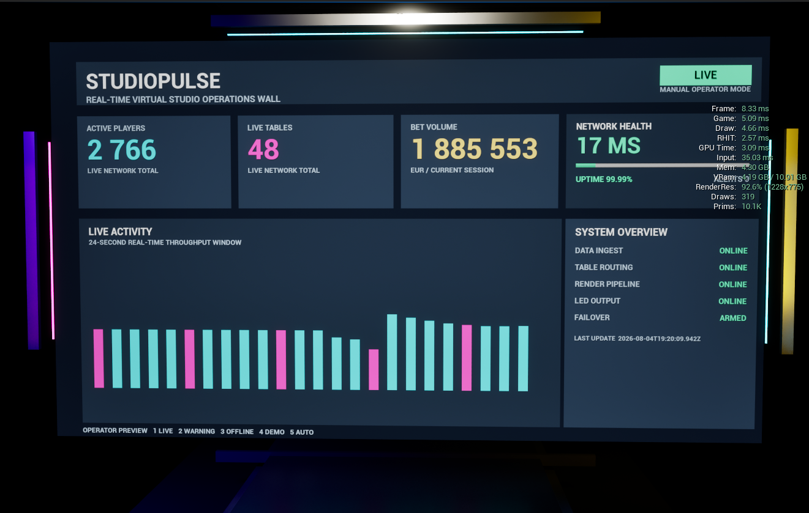
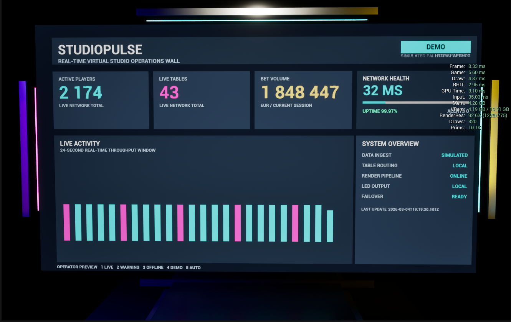
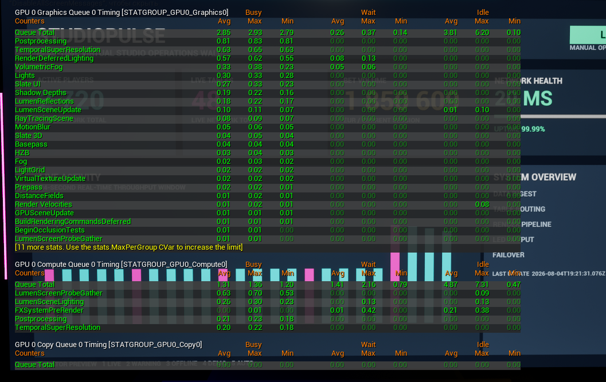
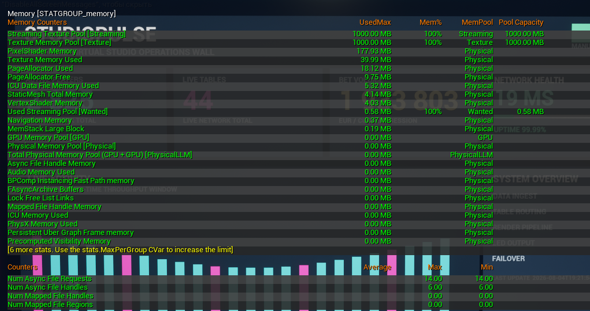

# Performance Profiling

## Scope

These measurements were captured in Unreal Engine 5.8 using Standalone Game at approximately 1228 x 775 on Windows.

Test machine:

- Intel Core i7-13700F
- NVIDIA GeForce RTX 5070 12 GB
- 32 GB system memory

The values below are measured profiling snapshots from one machine. They are not presented as cross-hardware benchmarks or multi-run statistical averages.

## Live and Demo Modes

| Metric | Live | Demo |
|---|---:|---:|
| Frame time | 8.33 ms | 8.33 ms |
| Estimated frame rate | capped 120 FPS | capped 120 FPS |
| Game Thread | 5.09 ms | 5.60 ms |
| Draw Thread | 4.66 ms | 4.87 ms |
| RHI Thread | 2.57 ms | 2.95 ms |
| GPU time | 3.09 ms | 3.10 ms |
| Draw calls | 319 | 320 |
| Rendered primitives | 10.1K | 10.1K |
| Process memory | 4.30 GB | 4.28 GB |

The equal 8.33 ms frame time indicates that both modes reached the configured 120 FPS cap. Switching between real-time Live presentation and simulated Demo fallback did not create a meaningful performance change in the captured run.

### Live Mode

### Demo Mode

## GPU Breakdown

Graphics Queue timing:

| Metric | Value |
|---|---:|
| Average | 2.85 ms |
| Maximum | 2.93 ms |
| Minimum | 2.79 ms |

Largest graphics passes:

| Pass | Average |
|---|---:|
| Post Processing | 0.81 ms |
| Temporal Super Resolution | 0.63 ms |
| Deferred Lighting | 0.57 ms |
| Volumetric Fog | 0.33 ms |
| Lights | 0.30 ms |
| Slate UI | 0.27 ms |
| Shadow Depths | 0.19 ms |
| Lumen Reflections | 0.18 ms |

The measured GPU workload remained well below the 8.33 ms budget for 120 FPS. In this capture, StudioPulse was not GPU-bound.

## Memory Snapshot

| Category | Used |
|---|---:|
| Texture memory | 39.99 MB |
| Pixel shader memory | 177.93 MB |
| Page allocator | 18.12 MB |
| Static mesh memory | 4.14 MB |
| Vertex shader memory | 4.03 MB |
| Wanted streaming memory | 0.58 MB |

The 1000 MB texture pool shown by Unreal is the configured pool capacity. The measured texture memory in use was approximately 40 MB.

## Engineering Conclusion

- Live and Demo modes maintained the same capped frame rate.
- The GPU had substantial headroom.
- The dashboard rendered approximately 320 draw calls and 10.1K primitives.
- The communication and fallback modes did not introduce a visible performance spike.
- No immediate performance remediation was required for this showcase scene.