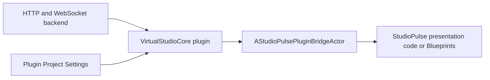

# Virtual Studio Core Integration

StudioPulse consumes the standalone `VirtualStudioCore` plugin through a real C++ module dependency and a host-project bridge Actor.

Standalone plugin:

https://github.com/milenastrahova/VirtualStudioCore

## Integration Boundary



## Host Module Dependency

`StudioPulse.Build.cs` exports a dependency on:

```text
VirtualStudioCore
```

This allows StudioPulse public C++ types to use plugin structs, enums, components and delegates.

## Bridge Actor

```text
AStudioPulsePluginBridgeActor
```

The bridge owns:

```text
UVirtualStudioConnectionComponent
```

It exposes host-facing Blueprint events:

```text
OnPluginTelemetryReceived
OnPluginStateChanged
OnPluginError
```

It also provides Blueprint-callable wrappers:

```text
ConnectPlugin
DisconnectPlugin
RequestPluginSnapshot
SendPluginMessage
```

## Responsibility Separation

The plugin remains responsible for:

- HTTP and WebSocket transports;
- JSON parsing;
- connection state;
- reconnect and backoff;
- simulated fallback;
- generic Blueprint API.

StudioPulse remains responsible for:

- project-specific presentation;
- dashboard layout;
- operator-facing behaviour;
- portfolio showcase modes.

## Verification

The integration pass verifies:

- Runtime plugin module compiles as a StudioPulse dependency;
- Editor plugin module still compiles;
- bridge default subobject is created;
- bridge does not use per-frame Tick;
- host Blueprint API is reflected;
- host project can read plugin settings;
- all eight plugin tests still pass;
- all StudioPulse tests pass with three new integration tests.

## Why This Matters

The same communication layer now exists as:

1. a standalone packaged plugin;
2. a source dependency inside StudioPulse;
3. a host-facing integration layer with its own tests.

That demonstrates reusable cross-project architecture rather than project-local code only.